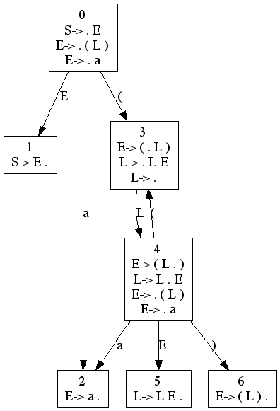

MAB 471 - Compiladores I
========================

Gabarito P3 2012.2 - 13/03/2013
-------------------------------

1\.

a)


JSON -> OBJ
OBJ -> numero
OBJ -> string
OBJ -> true
OBJ -> false
OBJ -> null
OBJ -> [ LISTA ]
OBJ -> [ ]
OBJ -> { PARES }
OBJ -> { }
LISTA -> OBJ LISTA'
LISTA' -> , OBJ LISTA'
LISTA' ->
PARES -> string : OBJ PARES'
PARES' -> , string : OBJ
PARES' ->

 
b)

Nota: é possível acertar essa mesmo errando a anterior, contanto que a derivação dada corretamente
derive a string do exemplo.


JSON -> OBJ -> { PARES } -> { string : OBJ PARES' } -> { string : string PARES ' }
  -> { string : string , string : OBJ PARES' } -> { string : string , string : numero PARES' }
  -> { string : string , string : numero , string : OBJ PARES' }
  -> { string : string , string : numero , string : true PARES' }
  -> { string : string , string : numero , string : true , 
       string : OBJ PARES' }
  -> { string : string , string : numero , string : true , 
       string : [ LISTA ] PARES' }
  -> { string : string , string : numero , string : true , 
       string : [ OBJ LISTA' ] PARES' }
  -> { string : string , string : numero , string : true , 
       string : [ { PARES } LISTA' ] PARES' }
  -> { string : string , string : numero , string : true , 
       string : [ { string : OBJ PARES' } LISTA' ] PARES' }
  -> { string : string , string : numero , string : true , 
       string : [ { string : string PARES' } LISTA' ] PARES' }
  -> { string : string , string : numero , string : true , 
       string : [ { string : string PARES' } LISTA' ] PARES' }
  -> { string : string , string : numero , string : true , 
       string : [ { string : string , string : OBJ PARES' } LISTA' ] PARES' }
  -> { string : string , string : numero , string : true , 
       string : [ { string : string , string : numero PARES' } LISTA' ] PARES' }
  -> { string : string , string : numero , string : true , 
       string : [ { string : string , string : numero } LISTA' ] PARES' }
  -> { string : string , string : numero , string : true , 
       string : [ { string : string , string : numero } ,
                  OBJ LISTA' ] PARES' }
  -> { string : string , string : numero , string : true , 
       string : [ { string : string , string : numero } ,
                  { PARES } LISTA' ] PARES' }
  -> { string : string , string : numero , string : true , 
       string : [ { string : string , string : numero } ,
                  { string : OBJ PARES' } LISTA' ] PARES' }
  -> { string : string , string : numero , string : true , 
       string : [ { string : string , string : numero } ,
                  { string : string PARES' } LISTA' ] PARES' }
  -> { string : string , string : numero , string : true , 
       string : [ { string : string , string : numero } ,
                  { string : string , string : OBJ PARES' } LISTA' ] PARES' }
  -> { string : string , string : numero , string : true , 
       string : [ { string : string , string : numero } ,
                  { string : string , string : numero PARES' } LISTA' ] PARES' }
  -> { string : string , string : numero , string : true , 
       string : [ { string : string , string : numero } ,
                  { string : string , string : numero } LISTA' ] PARES' }
  -> { string : string , string : numero , string : true , 
       string : [ { string : string , string : numero } ,
                  { string : string , string : numero } ] PARES' }
  -> { string : string , string : numero , string : true , 
       string : [ { string : string , string : numero } ,
                  { string : string , string : numero } ] }


2\.

3\.
 
a)


String codigo(Env<String> env) {
  String res = "(" + objeto.codigo(env) + ")." + metodo;
  if(args.size() == 0)
    return cobj + "()";
  else {
    res += "(" + args.get(0).codigo(env);
    for(int i = 1; i < args.size(); i++)
      res += "," + args.get(i).codigo(env);
    return res + ")";
  }
}


a)


String codigo(Env<String> env) {
  env = env.extende();
  String res = "do {\n";
  for(Cmd cmd : corpo)
    res += corpo.codigo(env) + "\n";
  res += "} while(!(" + condParada.codigo(env) + "));"
  return res;
}

